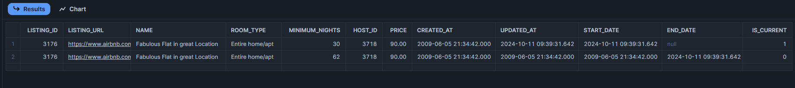
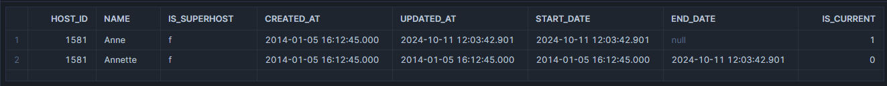

Welcome to your new dbt project!

# dbt Core Example Project

This project runs through the standard dev process for a dbt project starting with setting up the dbt project.yml
, staging, intermediate models, dimensional models and lots of testing using generic, custom test, package tests and some macros.

All is documented as well.

Below is the star schema created. The model includes a seed to test a hypothsis (which is not dome here but onky built for such purposes).

## dbt models

The star schema contains two dimensions with their corresponding history dimesnions as they are both type 2 slowly changing dimensions.

The various layers applied in three pahses are as follows:

- stage
- intermediate
  - incremental : to capture new data in increments to a fact table.
  - scd type 2 (change data capture for history)

#### SCD Type 2

- core
  - marts : to cpature various business process requirements like SCD's.
  - dim : to capture context for facts.
  - fct : to capture measured business processes.

The fact table is materailzed as incremental for demonstration purpose as it would typically just be a fresh rebuild given its size. Howevere, this fact is set up to run ion three diffeent jobs, slim CI for changes, standard daily deploy to capture new data and a full refresh weekly to make sure no increments have been missed.

## dbt seeds
 A seed is used as a small static data set to capture full moon dates for a further examination of curomer behavior on full moon review dates. Thi sis designed as a one off and not really  a modeliing aspect of dbt build a feature that is a "good to have".

## dbt testing
- generic
- custom
- third-party packages for testing or audting

All tests are applied on this model. Gneric testing is compleetd in each schema/yml file with some thrid party packaging such as metea_testing rto enure we have the required generic tests for some models.

## dbt packages

Packages used:
- meta_testing (to enure test coverage for generic test)
- dbt_utils (to generate surrogate keys)

## Documentaion
All phases are documented with appropriate audiences in mind.

TBC - this section still under construction.

### Lineage

### Overview

