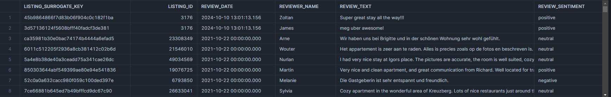
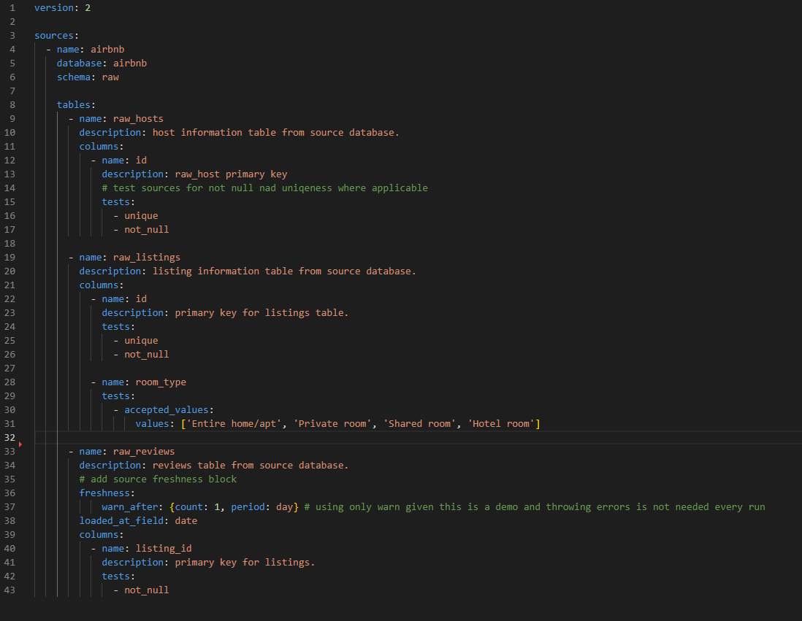
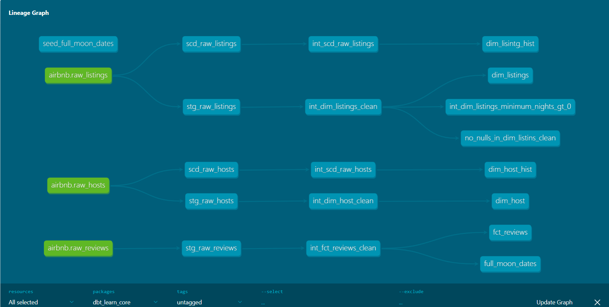

# dbt Core Example Project

This project runs through the standard dev process for a dbt project starting with setting up the dbt project.yml
, staging, intermediate models, dimensional models and lots of testing using generic, custom test, package tests and some macros.

All is documented as well.

Below is the basic star schema created. The model includes a seed to test a hypothsis (which is not done here but built for such purposes downstream as is the usual for DE pipelines).


## dbt models

The star schema contains two dimensions with their corresponding history dimesnions as they are both type 2 slowly changing dimensions.

The various layers applied in three phases and are as follows:

- **stage:** ingests the raw data, does light transformations and adds aliases as needed.

- **core:** The core layers holds the breakout for the star scjema and also the intermediate layer of the pipeline where the larger transformations take place before being referenced by the prod models for dimension or fact.

  - **intermediate**
    - **incremental:** to capture new data in increments to a fact table.
    - **scd type 2:** (change data capture for history).
  
  - **marts**:** to capture various business process specific to BI requirements such as fiance or even a fully denormalized table that is run with a single select statement.

  - **dim:** to capture context for facts.
  - **fct:** to capture measured business processes.

#### SCD Type 2


SCD Type 2 code example:

step 1.
```sql


{{
    config(
        target_schema='dev_snapshots',
        unique_key='id',
        strategy='timestamp',
        updated_at='updated_at',
        invalidate_hard_deletes=True 
    )
}}

    select *
    from {{ source('airbnb', 'raw_hosts')}}


```


step 2: Create the intermediate model and add an is_current column

```sql
with scd_hosts_transformed as(

    select  
        id as host_id,
        name,
        is_superhost,
        created_at,
        dbt_updated_at as updated_at,
        dbt_valid_from as start_date,
        dbt_valid_to as end_date,
        case when dbt_valid_to is null then 1 else 0 end as is_current
    from 
        {{ ref('scd_raw_hosts') }}
)

select *
from scd_hosts_transformed
```

The fact table is materailzed as incremental for demonstration purpose as it would typically just be a fresh rebuild given its size. Howevere, this fact is set up to run ion three diffeent jobs, slim CI for changes, standard daily deploy to capture new data and a full refresh weekly to make sure no increments have been missed.

Example of the incremental output:



Incremental code:

```sql

{{
    config(
        materialized ='incremental',
        on_schema_change='fail',
        schema = 'int_incrementals'
    )
}}


with fact_reviews_cleaned as(

    select *
    from
        {{ ref('stg_raw_reviews') }}

)

select 
{{ dbt_utils.generate_surrogate_key(['listing_id', 'review_date', ' reviewer_name', ' review_text']) }} as listing_surrogate_key,
*
from fact_reviews_cleaned
where review_text is not null
    -- incremental macro to get only new records by using max review date from previus run to compare to current
    

        and review_date > (select max(review_date) from {{ this}} )

    
```

## dbt seeds
 A seed is used as a small static data set to capture full moon dates for a further examination of curomer behavior on full moon review dates. Thi sis designed as a one off and not really  a modeliing aspect of dbt build a feature that is a "good to have".

 dbt seed is ran by simply entering:

 ```sql
 dbt seed
 ```

## dbt testing
- generic
- custom
- third-party packages for testing or audting

All tests are applied on this model. Gneric testing is compleetd in each schema/yml file with some thrid party packaging such as metea_testing rto enure we have the required generic tests for some models.

*Typixcally, I test all sources first, I add generic tests to my source.yml as an example:*



From here, I test at every layer as I build them and add a few extras like some singualr tests:

```sql
-- stage raw listings does have 0 for some results so this is to fix that
select *
from 
    {{ ref('int_dim_listings_clean') }}
where minimum_nights < 1
```

This can also be done as a custom generic test:

```sql
-- custom test
-- test for greater tahn zero values in a column
-- can be called as a generic test in your schema.yml



    select *
    from
        {{ model }}
    where {{ column_name }} < 1


```

## dbt packages

Packages used:
- meta_testing (to enure test coverage for generic test)
- dbt_utils (to generate surrogate keys)

* I like to add a schema level meta test to ensure I have the proper generic tests in place. For this I use meta_testing as seen below.*

```sql
# ensure testing on selected schemas
packages:
  - package: tnightengale/dbt_meta_testing
    version: 0.3.6
  - package: dbt-labs/dbt_utils
    version: 1.3.0
```


## Documentaion
All phases are documented with appropriate audiences in mind.

TBC - this section still under construction.

to run for docs with dbt core:
 ```sql
dbt docs generate
 ```
 and then:

 ```sql
 dbt docs serve
 ```

### Overview/Pipeline Lineage
Here is a wuick overview of the model lineage that the code produces.




### Conclusion:
Building pipelines is a lot of work. It requires a meticulous and patitent outlook wiht a lot of foresight. A pipeline spec document is always a great idea to capture the various angles an basic layouts of the design with your stakeholders. 

Most importantly though, build robust tests! This the core of dbt so use it to your advantage. For docs in production, I use confluence as I tend to use dbt cloud exclusively and it makes storing assets a bit difficult. Confluence is easier imo to store and index all your project docs while linking to your repo.

